#PL/SQL简介
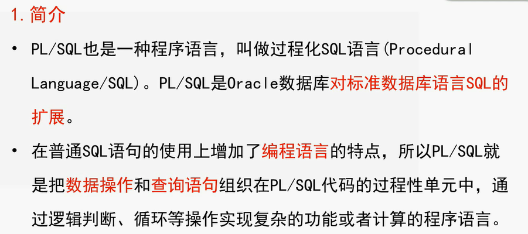
声明部分、执行部分、异常处理部分

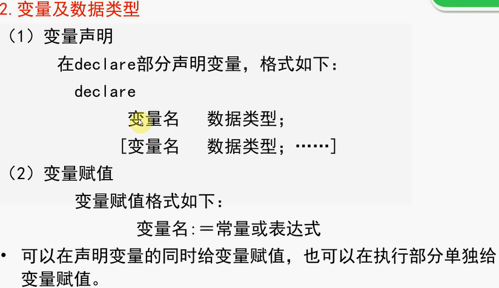
```sql
DECLARE 
    v_sno VARCHAR2(10) :='04001';
    v_cno VARCHAR2(10) :='001';
    v_grade NUMBER :=90;
BEGIN 
    INSERT INTO SC VALUES (v_sno,v_cno,v_grade);
    CONNIT;
END;
```

练习实例
```sql
DECLARE 
    m sc.sno%type;
    n sc.cno%type;
    t sc.grade%type;//没有必要提前知道数据列的数据类型
BEGIN 
    m='04001';
    n='001';
    t='90';

    INSERT 
    INTO SC 
    VALUES (m,n,t);
    CONNIT;
END;
```
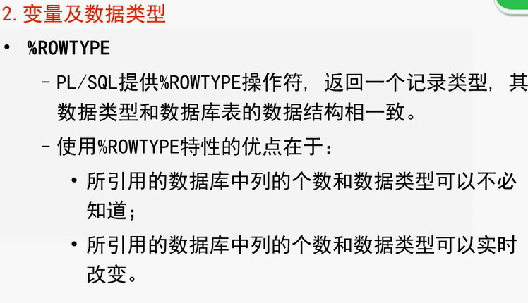

```sql
DECLARE 
    m sc.sno%rowtype;
BEGIN 
    m.sno='04002';
    m.cno='001';
    m.grade='91';
    INSERT 
    INTO SC 
    VALUES (m.sno,m.cno,m.grade);
    CONNIT;
END;
```

##运算符与表达式
###一般运算符
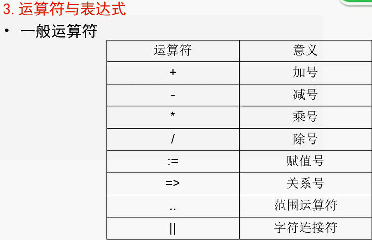
关系符号作用：调用存储过程中为形参赋值

###关系运算符
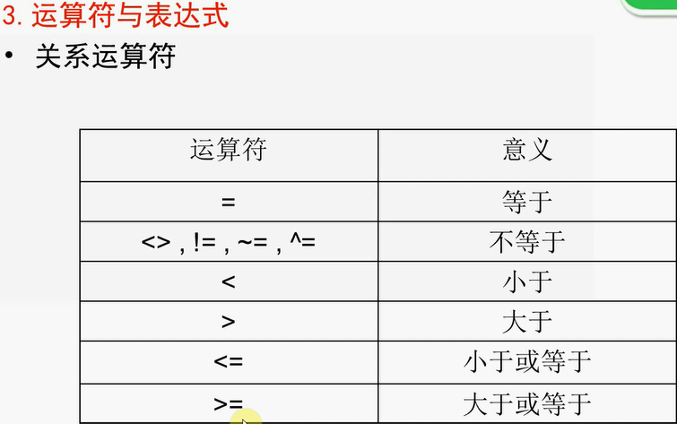

###逻辑运算符
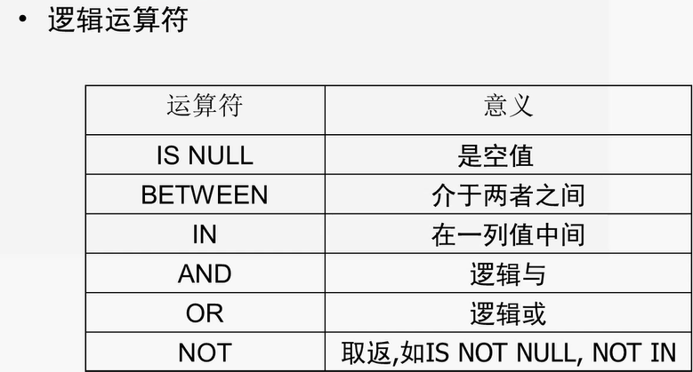

###流程控制语句
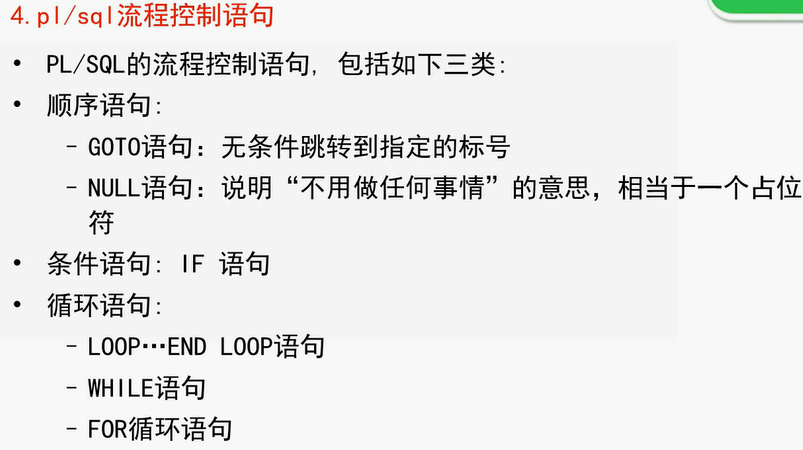
####条件语句
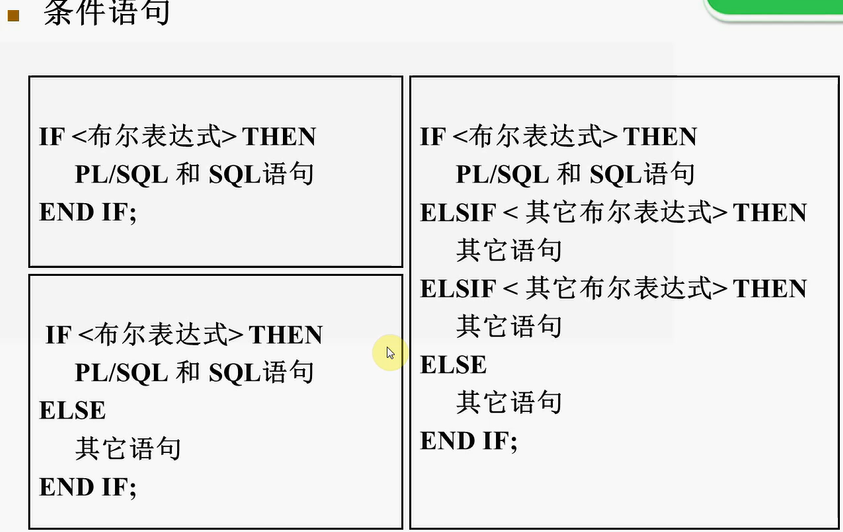

```sql
DECLARE 
    m sc.grade%type;
BEGIN 
    select grade into m
    from sc
    where sno ='04001' and cno = '005';
    if m<60 then
        dbms_output.put_line(‘不及格’);
    elsif m>=60 and m<80 then
        dbms_output.put_line(‘及格’);
    elsif m>=80 and m<90 then
        dbms_output.put_line(‘良好’);
    else
        dbms_output.put_line(‘优秀’);
    end if;
END;
```
####循环语句
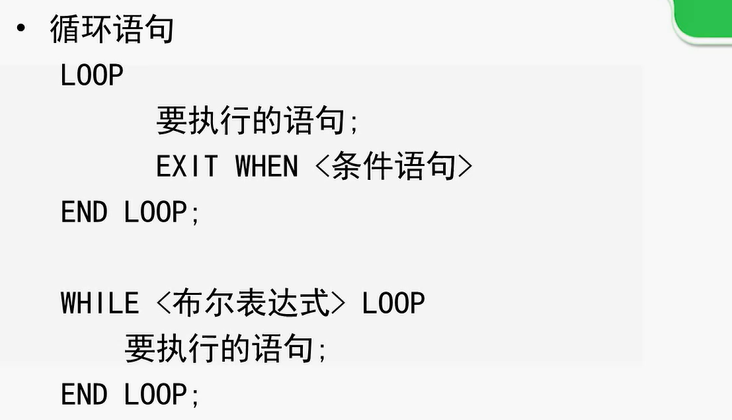


#游标

声明游标
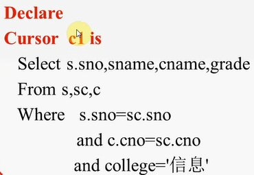
打开游标

提取游标数据
移动游标指针
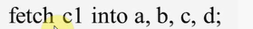
```sql
DECLARE 
    a varchar2(10);
    b varchar2(20);
    c varchar2(40);
    d number;
    m number;
    cursor c is select s.sno,sname,cname,grade;
        from s,sc,c
        where s.sno=sc.sno and c.cno=sc.cno and college='信息'; 
BEGIN 
    open c1;
    loop
        fetch c1 into a,b,c,d;
        exit when c1%notfound;
        if(d>60)then
            m:=m+d;
            dbms_output.put_line(a||b||c||d||m);
        end if;
    end loop;
    close c1;
END;
```

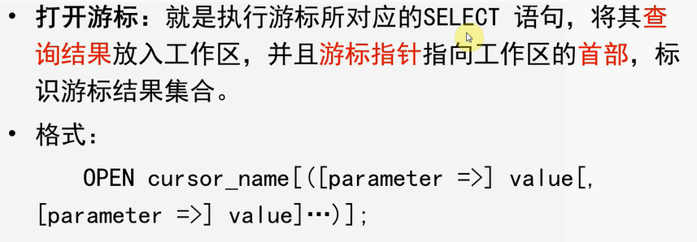
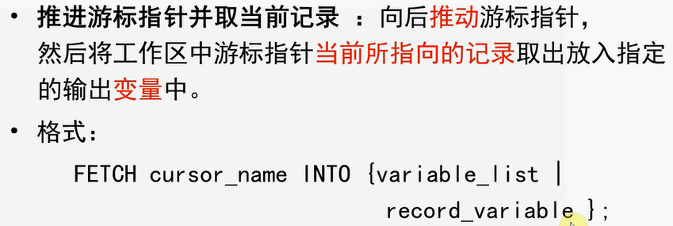
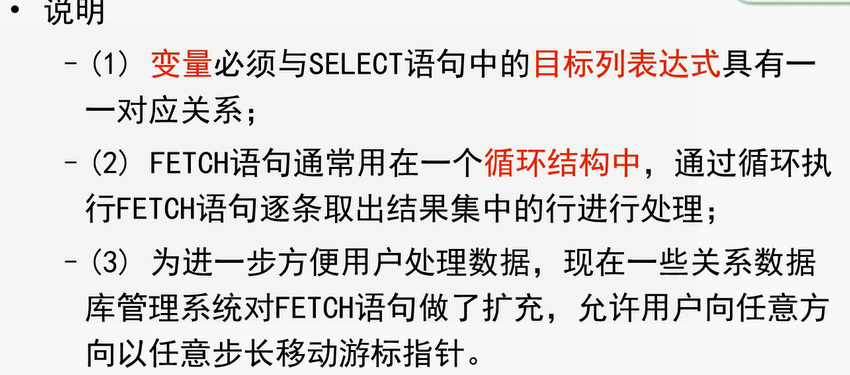
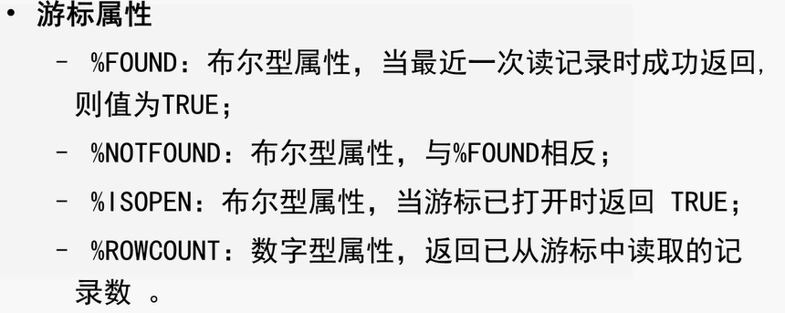

#存储过程

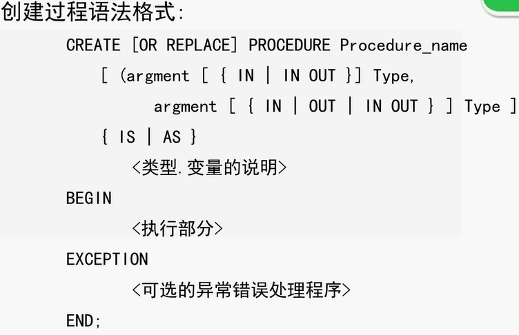
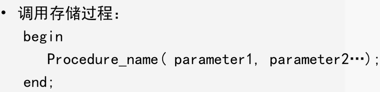

```sql
DECLARE 
    a varchar2(10);
    b varchar2(20);
    c varchar2(40);
    d number;
    m number;
    cursor c is select s.sno,sname,cname,grade;
        from s,sc,c
        where s.sno=sc.sno and c.cno=sc.cno and college='信息'; 
BEGIN 
    open c1;
    loop
        fetch c1 into a,b,c,d;
        exit when c1%notfound;
        if(d>60)then
            m:=m+d;
            dbms_output.put_line(a||b||c||d||m);
        end if;
    end loop;
    close c1;
END;