#用户管理
##创建
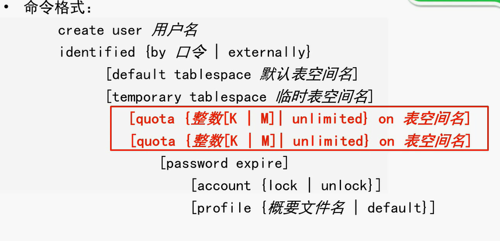
```sql
create user u1
    identified by 123456//密码
    default tablespace users
    temporary tablespace temp
    quota unlimited on users 
```
u1
123456
ORACL
NORMAL
使用上述信息，无连接数据库权限

**指定权限**
####修改
```sql
alter user u1 password expire
u1口令修改为过期状态
再次登录需要指定新的密码

```
####删除
```sql
drop user Yonghuming [cascade]
指定cascade将会删除该用户的所有对象
Table下的所有对象将被删除
若不指定将会先提醒
```

#模式
##用户权限
模式：一系列逻辑数据结构或对象的集合
**模式与用户的关系:**
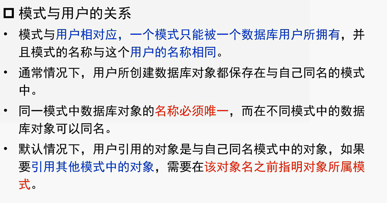
**模式切换与选择**
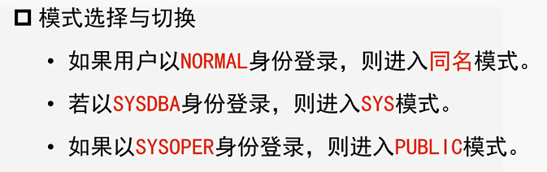

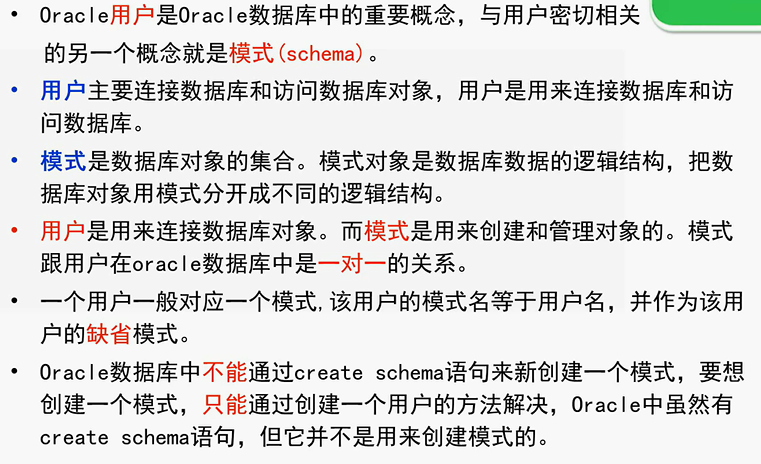
###权限管理
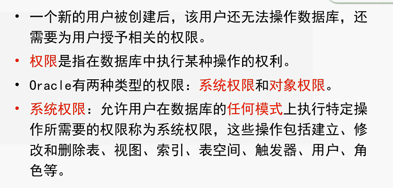

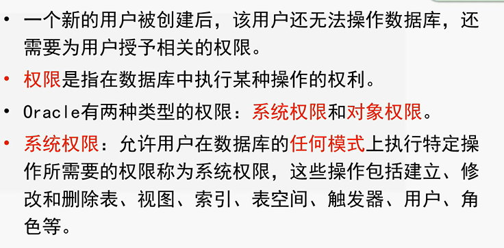
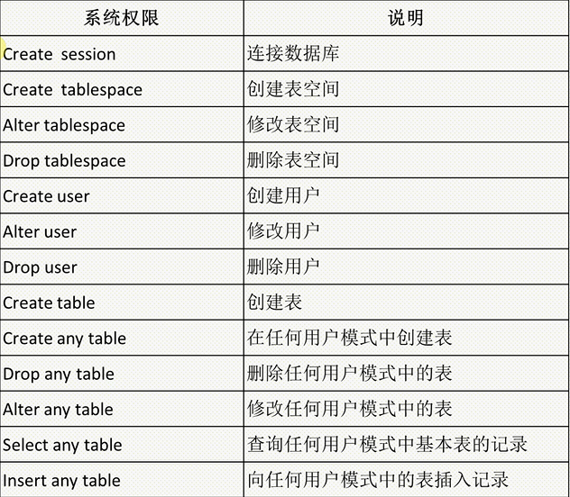
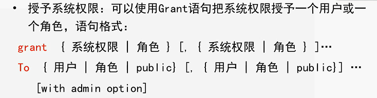
```sql
查询所有系统权限
select * from system_privilege_map

为用户u1授予在任何用户模式下创建表的权限和查询任何模式中基本表中数据的权限
1.首先授予u1用户连接数据库的权限
grant Creat session
to u1

2.完成之后可以点击u1单击右键选择编辑，之后查看系统权限，将会发现CREATE SESSION

3.之后便可使用用户u1进行登录
用户名：u1
密码：123456
ORACL
NORMAL

4.继续操作
grant Creat any table,
 Select any table
to u1

5.当前情况下可以建表
create table ban.test//在ban用户下建表
(a number,
b date)
```
###权限回收
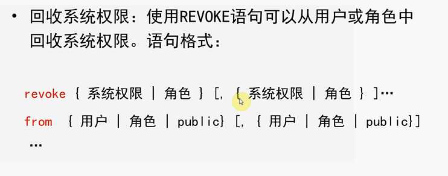

##对象权限
基本定义
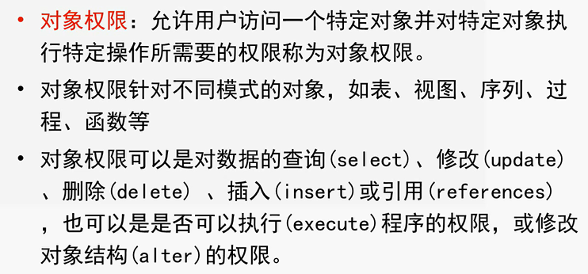
授予对象权限
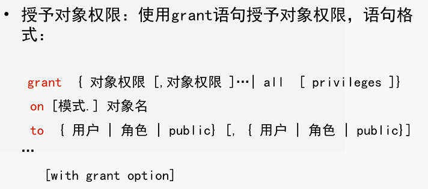

```sql
授予u1，u2对对象s的所有权限
grant all privileges
on s
to u1,u2

//把查询s表和修改学生学号的权限授予u3.并允许他再将次权限授予其他用户
grant update(sno)，select
on s
to u3
with grant option//并允许他再将次权限授予其他用户
```
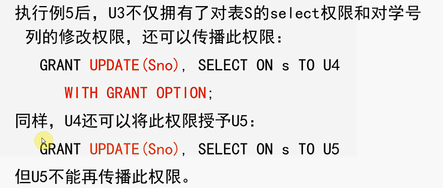
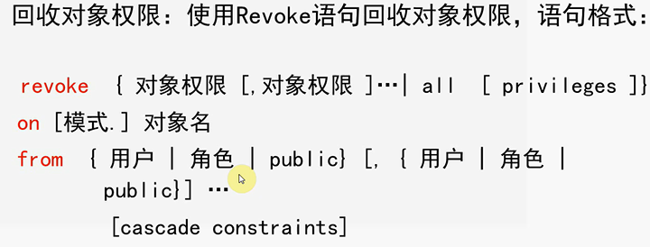

#练习
```sql
1．用系统帐户sys登录数据库，分别创建数据库用户lisa和tom，初始帐户口令都为“888888”，要求将密码设置为过期状态，初次登录时强制修改密码。为两个用户指定默认表空间为users，并且在users表空间中使用大小不受限制。 
create user lisa
    identified by 888888//密码
    default tablespace users//默认表空间为users
    temporary tablespace temp
    quota unlimited on users//表空间中使用大小不受限制
        password expire//密码设置为过期状态

create user tom
    identified by 888888//密码
    default tablespace users//默认表空间为users
    temporary tablespace temp
    quota unlimited on users//表空间中使用大小不受限制
        password expire//密码设置为过期状态
2．为了使lisa和tom能够登录数据库，请为其授予相应的权限。
grant Creat session
to lisa
grant Creat session
to tom
3．授予用户lisa在自己模式下创建表的权限，在任何模式下删除表的权限，授予用户tom可以在任何模式下创建表的权限，查询任何模式下表中数据的权限和在任何模式下创建视图的权限。
grant create tablespace,
drop tablespace to lisa

grant create any tablespace,
select any tablespace,
create any view
to tom

4．分别用lisa和tom登录，写出相应的SQL语句验证为其授予的权限。（如果建立的表中有主键约束，需要预先授予lisa和tom用户create any index的权限。）
create table tomTable1
(
    a date,
    b varchar(20)
)

create table lisaTable1
(
    a date,
    b varchar(20)
)
(lisa在自己模式下创建表的权限，在任何模式下删除表的权限)
create table lisaTable2
(
    a date,
    b varchar(20)
)
insert into lisaTable2 (a,b) values (1,"bb");
drop lisaTable1;
drop tom.tomTable1;

(tom可以在任何模式下创建表的权限，查询任何模式下表中数据的权限和在任何模式下创建视图的权限)
create table tomTable2
(
    a date,
    b varchar(20)
)
create table lisa.tomTable3
(
    a date,
    b varchar(20)
)
select * from lisa.lisaTable2;


5．用系统帐户sys登录数据库，创建用户user1_admin，将角色权限DBA授予用户user1_admin，并将S、P、J、SPJ四张表导入到user1_admin模式下。
6．用user_admin登录，完成以下授权。（要求授完权后，在lisa和tom用户下执行相应的SQL语句验证授权是否成功，相同的权限只需验证一个即可。）
（1）把对表s的insert权力授予用户lisa，并允许他再将此权限授予其他用户。
（2）用户tom对s，p，j三个表有select和insert权力
（3）用户lisa对spj表有delete权力，对qty字段具有update权力。
（4）收回lisa对s表的插入权限。
7．把对用户tom授予的所有权限收回，只保留登录权限。（系统权限和对象权限应该分别写语句收回）
8．用系统帐户sys登录数据库，创建用户user2_admin，将角色权限DBA授予此用户，在user2_admin的模式下导入Sudent、Course、Teacher、TC和SC表。
9．使用user2_admin登录，创建角色school_manager，将user2_admin模式下五张表的插入、删除、修改和查询数据的权限授予角色school_manager，将角色的权限授予tom。
10．对于通过school_manager角色授出的权限，在tom用户下执行相应的SQL语句对权限进行验证。
```